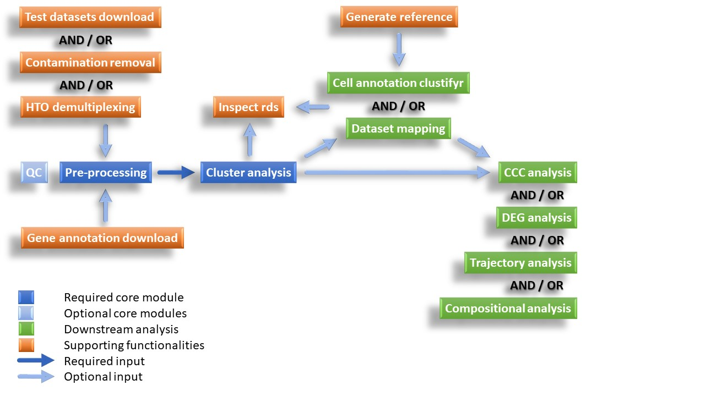

# UNDER DEVELOPMENT !!!

Lets add a test

# Preamble  
  
**At moment, the workflow is under development and only running and tested on RStudio server at Medizinische Hochschule Hannover (MHH)** 
**The workflow is set up for the kosankem user on hpc-rc11 on HPC at MHH!**  
**Before starting, see docs/Run_sc_analysis_workflow.docx (TO DO) for an instruction how to run the workflow!**(Includes installation documentation and instruction for usage)  
  
  
  
----------------------------------------------------------
  

# Table of contents
* [Introduction](#introduction) 
* [News](#news) 
* [Workflow summary](#workflow_summary)
* [Installation](#installation) 
* [Quick start](#quick_start)
* [Usage](#usage) 
* [Output](#output) 
* [Documentation](#documentation)
* [Credits](#credits)
* [Contributions and support](#contributions_and_support)
* [Citation](#citation)

# Introduction
<a name="introduction"/>

**sc-analysis** is a bioinformatics analysis workflow for single-cell RNA-seq analysis. The workflow is based on Seurat and the scrnaseq workflow (status May 4, 2022; Code on Zenodo: https://zenodo.org/record/7849063) created from Dresden-concept Genome Center URL "https://genomecenter.tu-dresden.de". In addition, the workflow utilizes diverse R packages for data processing, visualization, and downstream analysis.   

The workflow is composed of modules. While some modules execute core sc-RNA seq data processing steps, others modules are optional providing basic, supporting functionalities or allowing further specific downstream analyses, such as dataset mapping or trajectory analysis. Each module can be run from command line or R(Studio) using the respective 'run_'-scripts, but an R Shiny Web App is also available to provide a more user-friendly interface. For more information regarding the scope of each module, refer to the module descriptions below.  
  
  
   
The workflow is appicable to single cell and nuclei RNAseq data pre-processed via 10x Genomics or SmartSeq-2 or for other data that are represented by a simple table with transcript counts per gene and cell. Similarly, a Seurat object can be loaded to inspect the stored scRNA seq data and perform downstream analysis.  

Example reports for the test dataset '10x_pbmc_small_split2samples' can be found in the GitHub repository under output/Testdata.  
  
  
# News
<a name="news"/>

**sc-analysis** workflow is under development.  
  
  
# sc-analysis Workflow summary
<a name="workflow_summary"/>

The workflow comprises different modules that can be run sequentially or independently as long as the required data input and object structure is provided. The modules are categorized into 'Pre-processing core modules', 'Downstream analysis', and 'Supporting functionalities' modules.  
  
## Pre-processing core modules
Core modules perform substantial scRNA seq data pre-processing steps, allowing quality estimationn and guided desicion making for algorithm selection and parameter setting in an iterative process. Hence, although the modules can be run independent of each other, a subsequent conduction of the core modules is recommended to acertain appropriate quality assesment and pre-processing performance.

### Module: qc
Core module to estimate cell quality and filter parameter, and - on downsampled data - investigate covariants, evaluate batch effects, and define normalisation, scaling, and sample combination strategy as well as number of principle components to use. This module is for quality assessment only, it does not output processed data! 
* Read data
   * Read gene annotation
   * Read scRNA-seq data
* Quality control
   * Determining filter thresholds
   * Genes with highest expression
* Normalization and scaling
   * Variable genes
   * Relative log expression
* Investigating covariants
   * Dimensional reduction
   * Principal component analysis
   * Feature plots
   * Cell Cycle Effect
   * Expression of apoptosis related genes
* Batch correction
* Determinig dimensionality of the dataset
  
### Module: pre-processing
Core module to perform filtering, normalization, scaling, and sample combination as well as dimensional reduction and clustering. The output contains visualisations to determine quality of filtered data and suitablility of chosen normalisation, and scaling, sample combination method as well as clustering tree and UMAP plots to determine appropriate cluster resolution. The pre-processing module generates a rds object that can be loaded as input into the cluster_analysis. 
* Read data
   * Read gene annotation
   * Read scRNA-seq data
* Pre-processing
   * Quality control (of filtered dataset)
   * Normalisation
   * Combine dataset
   * Scaling
   * Dimensional reduction
   * Batch effects
* Clustering
   * Clustering tree
   * Visualisation with UMAP
* Data export

### Module: cluster_analysis
Core module to evaluate and analyse cell clusters, including cluster QC, identification of marker genes, and cell type annotation. The cluster_analysis module generates a rds object on which further downstream analysis can be performed. 
* Read data
   * Read gene annotation
   * Read scRNA-seq data
* Clustering
   * Visualisation with UMAP
   * Cluster QC
   * Cell Cycle Effect
   * Distribution of cells in clusters
   * Fraction of clusters per sample
   * Assessing cluster separation
* Marker genes
   * Table of top marker genes
   * Visualisation of top marker genes
   * Expression per cluster per sample
   * Functional enrichment analysis  
* Cell type annotation with SingleR
   * Annotation of single cells
   * Annotation diagnostics
   * Annotation of clusters
   * Fraction of sample per cell type
   * Fraction of cell types per sample
* Data export

## Downstream analysis

### Module: dataset_mapping
Single cell transcriptomes can be difficult to annotate without extensive knowledge of the underlying biology. Hence, the biological knowledge (defined marker genes and cluster identities) can be propagated from a previously annotated dataset to the test dataset in an automated manner and aid in cluster identification. 
This module maps the cluster annotations from a reference dataset onto the query dataset. Reference and query dataset both need to be provided as Seurat objects.

### Module: cell_annotation_clustifyr
This module performs cluster annotation via clustifyr with reference datasets from clustifyrdatahub or ucsc.

### Module: ccc_analysis
Cell-cell communication (CCC) is a process by which cells react to stimuli during many biological processes. This module utilizes the LIANA tool to infer ligand-receptor interactions between cell types by running multiple CCC inference methods using a consensus resource and combines the results.

### Module: compositional_analysis (TO DO)

### Module: deg_analysis (TO DO)

### Module: trajectory_analysis (TO DO)

## Supporting functionalities

### Module: references_download
Module to download reference genome from ENSMBL via BioMart data mining tool.

### Module: test_datasets_download
Module to download test datasets. Test datasets are automatically stored in the appropriate format within the data folder. 
* download_10x_pbmc_1k_healthyDonor_v3Chemistry
* download_10x_pbmc_5k_protein
* download_10x_pbmc_hto_GSE108313
* download_10x_pbmc_small_split2samples
* download_10x_SmartSeq2_pbmc_GSE132044

### Module: inspect_rds
Module to load and inspect generated object before further downstream analysis. Moreover, the script generates a lists of plots that can be displayed or saved in the desired size and resolution.

### Module: generate_clustifyr_reference
Module to generate clustifyr reference from a chosen dataset that has to be downloaded beforehand from ucsc.

### Module: hto_demultiplexing (TO INCLUDE)

### Module: contamination_removal
Estimation and removal of ambient mRNA contamination in droplet based single cell RNA-seq data (here specifically 10x Genomics cellranger output) utilizing SoupX R package. 

# Installation
<a name="installation"/>

TO DO
Set config
  
# Quick start
<a name="quick_start"/>

Each module can be run from command line or R(Studio) using the respective 'run_'-scripts, but an R Shiny Web App is also available to provide a more user-friendly interface.

The repository provides download scripts for several useful test dataset that you can use to get to know the functionality of the workflow. To test the workflow using a test dataset, start with the qc and/or pre-processing analysis first, followed by the cluster-analysis module. This will generate the needed Seurat object on which further downstream analysis can be performed (see workflow diagram above).  
The workflow is inialised for test dataset '10x_pbmc_small_split2samples'. To run the workflow for another than the initial dataset, you need to select the respective data in the 'basic_settings.R' or via R Shiny Web App. 

  
## Run sc-analysis workflow from command line or R(Studio)
1) Set parameter values in basic_settings.R (required) and advanced_settings.R (optional if diverging from standard settings). Both setting scripts need to be located in the main /sc-analysis directory.  
  
2) Respective 'run_'-scripts are located within the /sc-analysis/scripts sub-directory.  
   a) In RStudio:  
      - Set working directory to /sc-analysis  
	  - Open respective 'run_'-scripts    
	  - Source respective script `source ./scripts/<run_script_name.R>`   
   b) Command line:  
      - Move into /sc-analysis directory 
	  - Run respective script `Rscript --vanilla ./scripts/<run_script_name.R>`
  
## Run sc-analysis workflow via R Shiny Web App
1) Open app.R in RStudio.
2) Run App.
3) Select analysis type.
4) Set parameter values, including advanced parameter settings if diverging from standard settings.
5) Click the Run analysis button and wait until analysis is completed. 
  

  
# Usage
<a name="usage"/>
TO DO
  
## Data input
TO DO
### Count matrix  
### test dataset 
### rds object 

### Test dataset

### Gene annotation reference
For some modules, gene annotation including Ensembl IDs, gene symbols, Entrez Ids, and Seurat gene names have to be loaded. By setting species (a basic parameter) and annot_version (advanced parameter), the references_download module automatically generates the required gene annotation file and the file with cell cycle genes needed for CellCycleScoring within the 'reference' folder.  
Default is Ensembl release 98 which corresponds to 2020-A reference package of 10x Genomics Cell Ranger Ensembl release 110 which corresponds to 2024-A reference package of 10x Genomics Cell Ranger.
ATTENTION: Translation cc genes between human and mouse does not work for version >105 (https://github.com/grimbough/biomaRt/issues/66). However, cylce gene annotation file generated using version 105 can be used instead. 
  
Alternatively, gene annotation file (advanced parameter 'file_annot') and cell cylce gene annotation file (advanced parameter 'file_cc_genes') can be loaded from a pre-prepared reference file.  

  
## Parameter settings
TO DO
  
A set of standard parameter settings is automatically loaded.  

### Basic parameter settings 
basic_settings.R (required)  

List of all basic parameters

TO DO

### Advanced parameter settings  
advanced_settings.R (optional if diverging from standard settings)  

List of all advanced parameters

TO DO

# Output
<a name="output"/>
The core modules as well as the modules for downstream analysis generate RMarkdown reports in html format with comprehensive visualisations, tables, and documentation describing the analysis steps and results.  
By default, the output in the 'output' folder. Within this folder, the workflow creates a project folder with the project_id as name and for each executed module a subfolder carrying the names of the respective module.  
The output varies depending on the module. However, most modules generate the following output data:  

* RMarkdown report (html format) with: 
   * Results and descriptions
   * Parameter table
   * Software versions
   * Credits and References
* data folder with: 
   * Seurat object
   * Anndata object  
   * Input files for 10x Genomics Loupe Browser
   * Count matrix files
   * Cell metadata file
   * Other output files (e.g. respective tables or plots) 
* figures folder with all plots in png, svg, and tiff format 

  
# Documentation 
<a name="documentation"/>

The workflow is tested with datasets of up to 15 samples with in total over 46000 cells. 
  
Comprehensive documentation can be found in the `docs/` directory:
 
[Installation](docs/...)   
[Running the workflow](docs/...)   

The folder also contains some handout-scripts for subsequent data investigation and visualiation in RStudio on local computers with less computational power. These scripts are specifically useful and designed to generate plot for publications tailored to the user's preferences, such as color scheme or size. 

  
# Credits
<a name="credits"/>

The workflow is based on the scrnaseq workflow (status May 4, 2022; Code on Zenodo: https://zenodo.org/record/7849063) developed by [Katrin Sameith](https://github.com/ktrns) and [Andreas Petzold](https://github.com/andpet0101) at the [Dresden-concept Genome Center (Dresden, Germany)](https://genomecenter.tu-dresden.de/about-us).
The workflow is based on the [Seurat](https://satijalab.org/seurat/) package and the vignettes were used as templates. Further packages and vignettes utilized for generating downstream analysis modules include [Liana](https://saezlab.github.io/liana/articles/liana_tutorial.html), [Clustifyr](https://rnabioco.github.io/clustifyr/articles/clustifyR.html), [clustree](https://cran.r-project.org/web/packages/clustree/vignettes/clustree.html), [SingleR](https://www.bioconductor.org/packages/devel/bioc/vignettes/SingleR/inst/doc/SingleR.html), and [SoupX](https://cran.r-project.org/web/packages/SoupX/vignettes/pbmcTutorial.html). 
Many thanks to all who have contributed.

  
# Contributions and Support
<a name="contributions_and_support"/>

  
# Citation
<a name="citation"/>

If you use this workflow to analyse your data, please cite it by mentioning the Research Core Unit Genomics (RCUG) of Hannover Medical School "https://www.mhh.de/en/genomics".
